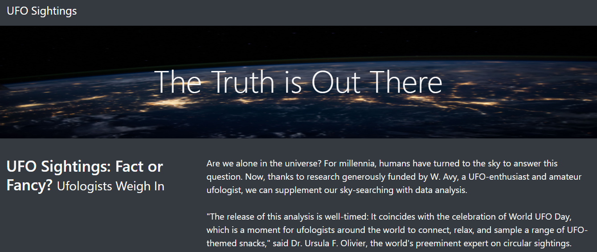
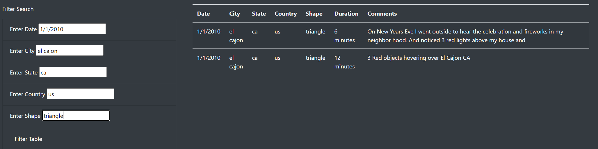

# UFOs

## Overview of Analysis:
The purpose of the UFO project is to build an HTML page that allows you to pull data from a javascrip object in one file and have a script in another javascript file allow you to filter through the data based on several filterable criterias. The final webpage was a clean HTML webpage output fully coded using Visual Studio. 

### Results
#### Title Page of Webpage

Above we have a clean HTML webpage that has includes a title over a graphic bakground and a small blurb that details whether UFO sightings are fact or fancy. Below we continue on to the data portion of the webpage that allows the user to filter the data set using several filter options such as City, Date and Shape. From here the data is the organized to match the filter options and is neatly displayed in a table.

## Summary
The final output is a clean webpage and allows the user to filter through the different sitings in our data set using the search bars created on the side. In order to make this webpage more attractive, I think adding one more filter that sorts through duration would be a great additon as well as links to images of the sightings if available. Overall, the webpage was a fantastic challenge and a great way to showcase my JS and HTML abilities.
